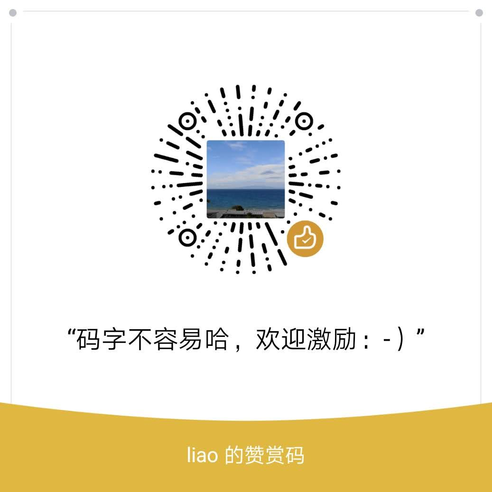

# 人生如程序，赢在算法，个人如企业，胜在管理

## --和家人朋友闲聊教育 

**前言**

2019年7月初成都休假，我和家人朋友闲聊教育和相关的各种话题，给读大学的侄儿侄女参考。事后决定总结整理聊天记录成笔记，供对教育有兴趣的朋友参考。 

注意事项：世界这么大，我个人能力，经历，认知都非常有限，对教育的看法都是盲人摸象，肯定错误不少，欢迎批评指正。我有空就根据反馈来改进更新。还有是**知易行难**，很多要点我自己也没做到，还在学习提高中。

抛砖引玉：公开自己的看法，可以抛砖引玉，让更有见识的朋友也分享类似的关于教育的真知灼见，让大家获益。 请愿意分享自己讲解的朋友联系我，我开放写权限给您。或者我加上您的大作的链接。

免责声明 ：聊天记录是个人见解，仅供参考，看了信了照着做，出了啥问题我概不负责哈。

版权：公共版权，欢迎转发。本文短链接 [https://tinyurl.com/liaochat](https://tinyurl.com/liaochat) , [https://bit.ly/2KPDdVR](https://bit.ly/2KPDdVR) 

---  C. Liao

# [教育的本质定义](chapters/definition.md)

# [健康和安全](chapters/healthAndsafety.md)

# [从智商本质施行教育](chapters/educationOnIntelligence.md)

# [读书](chapters/readingBooks.md)

# [人的模型](chapters/modelOfHuman.md)

# [做事的原则和技巧](chapters/algorithmOfDoingThings.md)

# [公共演讲](chapters/publicSpeaking.md)

# [学英语](chapters/english.md)

# [时间管理](chapters/timeManagement.md)

# [金钱](chapters/money.md)

# [其他杂谈](chapters/others.md)

# [有用的一些链接](chapters/references.md)

# 追求卓越，赋能他人

作为结束语，我得借用 Jason Lu ，一个硅谷华人高管的职场的精妙总结： 追求卓越，赋能他人。

按我的理解， 
*   追求卓越就是自己做事追求高价值，高社会影响力，高质量，高水平，永远提升。 
*   赋能他人是对周围的任何靠谱的人都持服务心态（自己是一个企业，别人都是衣食父母，自己的客户），互助心态，让他人也可以最大程度的提升和成功。 

这样的心态去生活和工作，可以在自己身边创造一个共赢的周边环境，自己和他人都能最大效率的创造价值。最后水涨船高，自己也很容易最后受益。

# 特别感谢

此聊天记录，源于表姐和她的闺蜜（谭姐）带上几个读大学或者快读大学的娃娃，与我在成都的聚会。非常感谢她们和我的交流，让我有机会系统化的总结我对教育的看法，提供各种反馈，并且鼓励我写出来。

# 欢迎打赏

Or [paypal.me/liaoch](http://paypal.me/liaoch)

# 目前的一些反馈

1. 读了对教育的大框架有了。具体如何做还不知道。需要细化。

2. 国内初升高就淘汰很多人，感觉这个文档不是针对小娃娃的。

3. 能不能开课啊？

4. 如何获得绿卡？

5. 感觉太杂了，好几篇文章混着一起
