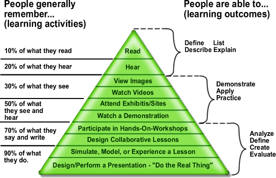

我虽然是一个学渣，但是还是有国内的亲戚朋友问一些如何教育娃娃的问题。我自己也有两个娃娃需要教育。另外我在工作，也需要一直自学和提升自己。教育他人和提升自己本质上是一回事，都是让一个人更有能力。这些原因让我思考到底教育他人或者自我提升应该如何下手？有哪些要素？如何知道是否有效？
​
人最大的特长是有大脑，有智慧。所以我就试试从智商开始分析：传统的智商指的是计算，空间想象，记忆，阅读，逻辑等能力。很多有识之士已经认为只看重智商来衡量一个人是不够全面的。传统教育也基本从传统智商的要素入手教育娃娃，有的时候可以教育出书本知识很厉害，但是一到实际工作，生活中就处处碰壁的人出来。所以我觉得应该一起探讨如何重新定义智商, 让它更贴近生活和工作的实际需求。

## 更全面的智商的定义

我来试试一个新的智商的定义：
  智商的本质 = 目标设置+ 学习 + 建模 + 感知+ 预测 + 决策 + 执行
 
一个真正高智商的人，应该有如下的能力：
* 会根据自己当前能力和外部环境的情况来设置合理的短期和长期目标。
* 学习能力强。
* 脑中有对自己，他人，环境中各种事物的准确模型。如果世界上的任何人和事物都看成一个模块，这些模型就代表各个模块的内部的功能和外部交互的方式。
* 会及时准确的感知自己和他人身心状况，察言观色，也会关心所在企业，行业，家事，国事，天下事。
* 做事(包括说话）前能用这些不同模型之间的交互作用来预测自己不同行动（包括说话）选择的可能的短期长期结果。
* 能根据预测结果果断的做出优化的行动选择。
* 有了选择后，能专注持久但又灵活的执行和调整计划。
搞过智能化软硬件系统的人一看这个定义，马上会说：这不就是智能系统的核心模块吗？是的，我认为智能的人和智能的软硬件系统，本质的几大核心功能模块应该是一样的。 例如我们要打造一个智能的机器人，就需要设计和制造目标设置，感知，学习，建模，预测，决策，执行模块。现代科技中智能系统研发中这些核心模块技术的发展（包括优化的算法），也应该可以用于对人的教育和提升。人生下来就已经具备了这几大能力的基本功能，我个人认为：教育娃娃，提升自己就是为了增强这些核心功能模块的功能，来应付一辈子的各种挑战达到人生的各阶段目的。
 
这个扩展的智商的定义实际上把情商也包括进来了。对他人建模，预测他人的反应来决定自己做啥，就是情商的范畴。

下面逐一探讨一下几大模块的细节：

## 目标设置

目标设置就是根据自己和环境的状况，制定自己短期和长期的目标。教育应该提倡每一个人都有一个长远的大目标，也学会把大目标分解成环环相扣的相对小的目标和当前情况衔接。这和地图上从当前立足点，通过努力尝试各种途径，到达目的地一样的过程。

* “上帝视角”看人和事。早日跳出第一人称视角，而是从第三人称（上帝角度）看待自己，随时评估自己以及周围人的处境，审视和优化自己和周围人+环境的交互，来制定自己的目标 。人和动物最大的区别是可以自省。动物每天靠本能驱动，吃喝拉撒。人可以停下来，想想自己的目标，现状，可以用理智抵御各种本能的冲动和短期的快乐来获得长期的收益。
* 目光长远，从自己的五年或者更长时期的目标倒推一步步的该怎么走。
* 当前目标设置的技巧是设置一个有足够挑战但是又能够通过努力达到的目标。如果一个目标只是按部就班的工作或者学习就达到了，就没有挑战性，完成了也没有成就感和进步。如果定的太大，拼尽全力也无法达到，让人沮丧和失去信心。所以需要通过教育和实践，随时可以估算自己的能力，定下适当的超出当前能力但是又可以通过努力实现的目标，一步步的进步。
* 汉语中一句有名的成语解释了为什么定目标要有难度：取法乎上，仅得乎中。意思是取上等的行为准则，也只能得到中等的。同理的说法：取法乎中，仅得乎下。指做事要高标准严要求。求知是一个漫长且艰辛的过程。这句古语对学子的启示在于，只有放宽视野，定高目标，才能取得令自己满意的成果。如果一开始就定个中等目标，最后结果往往是下等的结果。因为理想和现实永远有很大的差距。
 
更具体的目标设置可以应用一下SMART原则：

* Specific具体。笼统的目标没有操作性。
* Measurable可测量。无法数量化测量进展的目标很难跟踪进度和保证最后完成的质量。
* Attainable可实现，这个好理解。
* Relevant相关性，就是必要的和达到自己的目标必须的，不是可有可无的东西。
* Time—based 时效性，有个截至时间。没有截至时间的目标会一拖再拖，永远完不成。
 
也就是说目标要具体、可以客观数量化的测量过程和结果，坚持努力可以实现、对你的长期人生目标是紧密相关的，并且要在一定的期限内完成。

例如一个目标是自学编程。一个符合 SMART 标准的目标就是 学具体的一种编程语言例如Python。测量过程是看网上评价最好的一套20个章节教程的完成程度（0%-100%)。这个是自己通过努力可以完成的，因为课程本身设计是给零基础的人看的。自己想学是因为编程是职业发展提升的必须的技能，和游泳一样重要。时间限度是每课时两小时，每天学一课，计划三个星期内完成。

# 学习能力

 
## 学什么

如果教育的目的是帮助受教育者达到人生中的各种目的，那么学习的内容应该是和达到目的相关的任何东西，不应该局限于传统科目。

除了传统书本中的数理化，语文英语，历史地理生物化学之外。也应该学习人的特点，如何与人有效的交流，如何组织一个团队，如何处理金钱，弄懂相关的政府和私营机构流程。。。。自己是做事的主体，也应该学习如何找出自己的优缺点，如何激励自己，如何保养身体，保证营养，避免疾病，如何让自己每天都能以充沛的精力去追求自己的目标。

学什么的最佳例子是美国投资大神，查理·芒格（Charle Munger ）。他是沃沦·巴菲特的好友兼搭档，素有巴菲特“幕后智囊”和“最后的秘密武器”之称。两人共同缔造了投资界的神话——伯克希尔·哈萨维公司。芒格学习了所有重要学科的基本原理。这些学科包括历史学、心理学、生理学、数学、工程学、生物学、物理学、化学、统计学、经济学等。芒格把这些学科的知识在头脑中总结关联，形成一个复合的知识框架。在随后的日子里，他能够运用它们的交互模型分析投资机会，真金白银的在变化万千的市场中操盘获得最佳收益。

达到目标除了做对该做的事情外，防止各种错误和意外也很关键。所以教育中还得有人身安全教育，预防犯罪和天灾人祸（包括车祸），避开常见的吸毒赌博借贷陷阱，防止受骗上当的教育。目前传统学校教育中很少涉及这些内容。需要负责任的家长补充，和自己自学。

最好的例子又是芒格，别人都只钻研如何成功的时候，他从收集分析失败的反例开始。例如失败人生的各种情况，投资失败的各种情况，列出详细的清单。自己生活和投资的时候经常对照这些失败清单，检查自己是否会重复前人的大错误。

## 学习的量

提升学习能力还是要首先逐步提升自己学习的时间（量），然后才来谈提高学习的效率（质）。如果全职学生的话，应该逐步培养自己每天能10+小时高质量学习的能力。一天学习八小时是普通人的量，也只能达到普通人的结果，除非你是天才。学习的量达不到，只能说明还没有培养爱学习的习惯，没有其他更好的解释。喜爱的事情，熬夜都不会觉得累。

一天的学习到底如何安排？我读书的时候一天学习三个时段12小时，早上8-12点，下午1－5点，晚上6-10点, 极少熬夜，每天睡眠充足。有空基本就是上自习，泡图书馆。避免在寝室学习，干扰太大。学习一定去大家都在学习的地方（图书馆，教室之类），有好的环境互相促进。现在工作一天八小时之外也基本干自己喜欢的事（学习，义工，加班）。

## 学习的方法（质量）

我感觉学习方法主要是擅长记笔记，学了什么东西（包括章节，文章），一定要把学的知识总结归纳成要点（知识点），记入自己的知识库（第二大脑）。做到把书读薄（厚书变成精华的笔记）。说学了东西，但是最后偷懒没有自己的归纳总结笔记，基本很快会忘，等于没有学。学习的结果就是自己总结的笔记。没有笔记的学习是没有成果的。学霸都是记笔记，整理笔记的高手。学霸是考试之前班上同学都求着要求分享课堂笔记的人。

最近读书，看到号称世界上最佳的学习方法：费曼学习法。据说谷歌创始人，微软创始人都是该学习法的推崇者。费曼学习法的核心是学任何东西，都想象自己要把学到的东西转述教会另一个人。这个转述教会他人的过程，督促学习者记录和组织学到知识，梳理遗漏。在我看来这个方法和笔记学习法异曲同工。好的学习笔记，就是一部好的教案。

* 再进一步探讨如何提升学习的质量。人主要靠大脑接受各种刺激来学习接受信息。要想大脑对知识记得牢，理解深，就需要加强对大脑的刺激，加长刺激的时间，多种感官渠道刺激。
* 人的基本感官有视觉，听觉。所以学习最基本方法是阅读（单独视觉），听书（单独听觉），和课堂听老师讲（视觉和听觉并用）。这些方法大脑受的刺激的强度和长度有限，效果不是最佳。
* 进一步加深学习效果需要拿来应用。写成自己的知识库中的笔记是一种应用。写成教案(加上动脑归纳总结，动手写)，给别人讲授（加上说出来）也是一种应用。和同学讨论学习也是。还有直接实践应用到生活工作中（加上动手），是最好的应用。例如学编程，除了学课本知识，也应该加入实际编程项目实践。实际应用就加长了对大脑刺激的时间，进一步动了手，动了脑， 甚至全身投入，对大脑刺激最强，学习效果最好。这些应用也叫做主动学习，团队学习，和参与式学习。

美国国家培训实验室（National Training Laboratories）1960年左右搞了个学习金字塔（Learning Pyramid）试图把不同学习法的记忆保持效果归类。这个金字塔的样子如下：

图片来源：[ https://en.wikipedia.org/wiki/Learning_pyramid](https://en.wikipedia.org/wiki/Learning_pyramid)

文字概述上面图片中不同学习刺激法的记忆效率如下：

1. 自己阅读：10％ 记忆效果

2. 听别人说：20％

3. 看视频录像：30％

4. 看现场演示示范：50％

5. 自己说出来或者写出来： 70％

6. 设计教案给他人讲解： 90% 掌握

学习金字塔的归纳和数据后来发现不是很严谨，例如列出的记忆比例没法被其他科学家实验的结果重复和验证。不同人喜好不同的学习方法，效果也不一样。 例如我个人喜欢自己一个人阅读和写笔记，我太太就喜欢问别人问题或者看视频学习。 不过这个学习金字塔还是很有参考意义，引导老师和学生用多重途径加强和加长对大脑的刺激来加深学习的质量。

*   敢于向人请教

学习一般是自学为主，但是如果身边有专家，过来人，有经验的人士，也要学会有问题多请教，不要害羞。 我认识一个朋友，给我说了这样几句经典的话： 读万卷书，不如行万里路；行万里路，不如仙人指路。 所以有前辈指点迷津，经常可以事半功倍，少走不少弯路。

真正高层次的人是不会嘲笑你的任何问题的，因为他们懂得更多的年轻人的成功是提升社会总体财富价值，也是对施助者本身有益的 。 我们现在享有的各种高科技产品，便利的服务，都是世界各地各行各业的人成功的结果。例如智能手机，互联网，网上购物，微信支付等等。所以明智的人都乐于助人，帮助别人成长，解惑，成功，这样可以帮助增加社会总体的财富价值（优质的商品+服务+知识真理+正能量），也使自己和后代获利。高层次的人对不同国家也是类似的观念，不会希望其他任何国家搞砸，而真心希望所有国家都搞得红火，创造世界人民都可以分享的物质精神文明和财富。这样就是旅游都多了一个去处，还不说其他各种便利。

最近我无意中看到一本书的书名 <<一问一世界>>，非常震撼这个书名的精妙，我不提作者姓名，以免争议。 敢于开口问他人问题的人，就是给了自己打开不同世界的机会。因为害羞，怕丢面子而不敢吭声的人，痛失各种良机。

*   亲近的人往往身上也有很多值得学习的地方

但因为距离太近了容易被忽略（距离产生美，距离太近放大了缺点），所以教育是可以家庭互换娃娃交换学习的，也应该重视从父母身上看到各种优点来学习。

*   学多久

终身学习。不是读完博士就可以不读书，不学习新知识，新工具，新技能了。工作再忙，都应该每周划出固定时间学习，例如每周读一本书四小时。做成大事业的无一例外的都是终身学习的大师。

