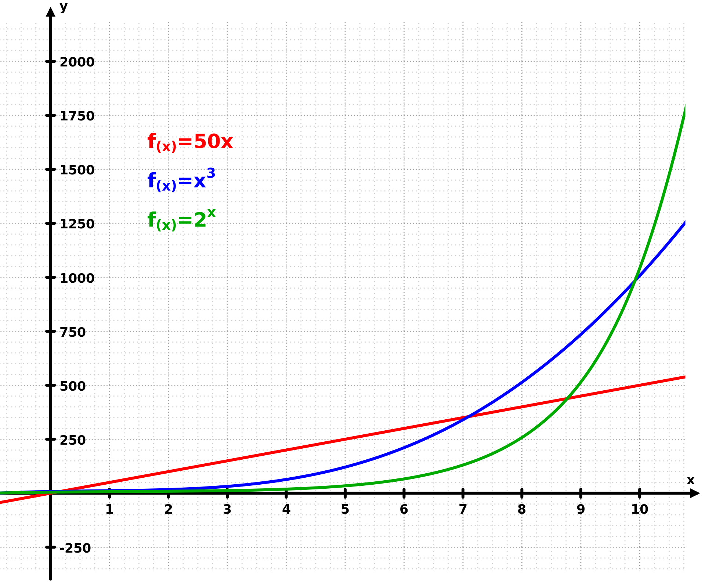

我穷人一个，钱的问题就少谈了，没有啥说服力。不过既然有人问，还是说说自己的一孔之见。金钱是重要的资源，可以维持自己和家人的衣食住行，也可以用来投资，组织生产和科研，创造更大价值（钱生钱）。


## 挣钱的本质

合法道德的挣钱方式是靠价值交换。自己通过体力脑力劳动，调用资源，为他人创造价值，然后获得金钱作为回报。或者家里有矿，祖上有珍宝和人交换 :-) 。

价值就是别人需要的，愿意付钱获得的东西。 常见的对人有价值的东西有满足基本需求的衣食住行日常用品，也有满足保暖后更高端的需求例如娱乐，安全，归属感，成就感等等。具体可以参照有名的马斯洛的七大需求模型。 另外永恒的价值是给别人省钱（挣钱），省时间。例如任何行业，都可以从如何给用户节省时间一直做下去。 互联网的挣钱口号，让用户爽，让用户快，让用户强。也是从创造客户价值出发找盈利模式。

   挣钱公式= 创造的单位客户价值*回报率 *客户数量 - 成本

大部分普通人，只有一个付钱的客户，自己的雇主。雇主给的职位和对应薪水是有限的。所以挣不了大钱。除非顶层的高级管理人员。

要挣大钱，就要从几方面入手 :

1. 给每个客户创造更高的价值

2. 提高回报率：就是客户付的钱

3. 扩大客户数量的规模：扩大客户规模有传统的线性增长（Linear growth）和现代基于互联网的指数型增长 (Exponential growh)两种差别很大的方式。指数型商业模式的介绍可以读 Exponential Organizations 《指数型组织:打造独角兽公司的11个最强属性》. 该书详细介绍了建立指数型企业的关键步骤。分析小米，阿里巴巴，优步，Airbnb， 谷歌等企业如何指数化自己的组织。




该图说明了指数增长（绿色）如何超过线性增长（红色）和幂增长（蓝色）。

  指数增长    线性增长    幂增长

图片来源：[ https://zh.wikipedia.org/zh-cn/%E6%8C%87%E6%95%B8%E5%A2%9E%E9%95%B7](https://zh.wikipedia.org/zh-cn/%E6%8C%87%E6%95%B8%E5%A2%9E%E9%95%B7)

4. 而且成本要小。成本是时间，金钱，和其他人力物力资源。互联网公司再次有成本优势。利用信息高速公路低成本的把有价值的信息传播给客户。

一个人生产力毕竟有限，所以必须学会调用更多资源才能做到上面的两个要素。要么借用现有的平台（互联网公司有很大的规模效应），要么自己做老板，成功的话是更容易挣大钱。普通的科技含量不高的餐馆，例如美国的熊猫快餐连锁店，因为规模效应，给老板创造的利润巨大。

知道了挣钱的本质，就可以帮助分析一个有趣的流行话题：为什么科学家挣钱不如明星？ 首先这个比较是不一定公平的，因为拿科学家和顶级演艺工作者在比较。 如果你拿普通演员比较，他们挣得钱不一定比普通科研工作者多。 顶级演艺工作者挣大钱主要是客户规模效应，给每个客户的娱乐价值绝对值不太大（几块几十块）。演艺作品的流通发行成本也很低。最后套用挣钱公式，当然就是大钱了。近几年流行的网红类似的挣大钱模式，是合理现象。

科学家就比较悲催了，首先客户规模极小。看得懂顶级科研成果的人全世界都没有几个。大部分科研圈子是自娱自乐，同行们互相吹捧和欣赏。 其次是科研成果经常是公开免费的，离市场可以卖的有价值产品或者服务还有几十年距离。最后收入靠死工资，一个雇主，所以有玩单反穷三代，搞科研毁一生的戏谑说法。

当然科学家里挣大钱的也不少，是因为学会了科研成果商品化，规模化了，或者是因为写了科普畅销书，拍了热门科普电视剧之类。


## 投资

美国投资主要是持有的股票，债券，出租房等。

学习投资强烈推荐一个网站（英文）：[ https://www.bogleheads.org/](https://www.bogleheads.org/)

这是一个由普通喜欢投资的志愿者按照 Jack Bogle的指数基金投资理念的交流场所。 约翰·克里夫顿·“杰克”·柏格（英语：John Clifton "Jack" Bogle，1929年5月8日－2019年1月16日）：Bogle先生读大学的时候研究投资，发现绝大部分时候专业的投资经理人主动投资选股票的收益比不过最简单的被动的投资整个股市大盘。 他就自己创办了共同基金公司领航投资(又译 先锋集团)（英语：The Vanguard Group）发行世界上第一款指数型基金 ──Vanguard 500 Index Fund。凭借低廉的收费和优质的投资回报，Vanguard从零开始变成美国最大的投资公司之一。

投资入门的网页:

[https://www.bogleheads.org/wiki/Getting_started](https://www.bogleheads.org/wiki/Getting_started)

官方的说明（简单中文译文）：

“欢迎来到Bogleheads社区！ Bogleheads是每天对投资和个人理财感兴趣的公民。成员们不仅讨论自己的财务问题，而且热情地为他人提供帮助。Bogleheads社区包括论坛，Wiki，三本投资书（The Bogleheads的投资指南，The Bogleheads的三基金投资组合指南， 和The Bogleheads的退休计划指南），在Facebook和Twitter上的社交交流，以及John C. Bogle金融扫盲中心。总之，我们正在尝试以尽可能多的方式向所有经验水平的投资者提供教育，帮助和相关信息。

这20年的旅程始于1998年，在Morningstar.com Vanguard Diehards论坛上进行。在2007年2月，我们决定启动自己的无商业论坛，以控制自己的命运。从那时起，论坛和Bogleheads社区的发展异常惊人。目前，我们有80个本地分会；美国境内有74个，美国境外有6个-欧洲，香港，以色列，新加坡，台湾和阿拉伯联合酋长国。新的章节会定期添加。从2000年开始，我们已经在全国主要城市举行了全国性会议。目前，我们每年秋天在费城见面。Bogleheads网站由志愿者运营，这些志愿者免费提供时间和才能。我们确实接受捐款以帮助支付运营成本。”


## 世界第八大奇迹：复利

爱因斯坦的名言： “复利是世界的第八大奇迹。懂它的人赚取复利，不懂它的人付出复利的代价。”

“Compound interest is the eighth wonder of the world. He who understands it, earns it ... he who doesn't ... pays it.”  ― Albert Einstein

复利的数学公式很简单

 A = P (1 + r)<sup>year</sup>

总额= 本金* （1+年利率）<sup>年数</sup>

所以聪明的人都很早就学会投资，用钱生钱。 在美国的，早日加入单位资助的401(k)个人退休金计划。没有单位资助的，也可以在 vanguard.com ， fidelity.com 上早日开个 IRA （Individual retirement account）个人退休金账户。 假设你25岁开始，本金在投资账户存10,000，年化的年利率 10%。 按10%复利的增长，差不多8年就翻一翻。 4个8年 (32年)。本金的1万就变成16万+。56岁后（31年后）的本金和利息滚利息的具体数据如下:


<table>
  <tr>
   <td>年数
   </td>
   <td>10%投资回报的金额
   </td>
  </tr>
  <tr>
   <td><p style="text-align: right">
1</p>

   </td>
   <td><p style="text-align: right">
<strong>$10,000.00</strong></p>

   </td>
  </tr>
  <tr>
   <td><p style="text-align: right">
2</p>

   </td>
   <td><p style="text-align: right">
$11,000.00</p>

   </td>
  </tr>
  <tr>
   <td><p style="text-align: right">
3</p>

   </td>
   <td><p style="text-align: right">
$12,100.00</p>

   </td>
  </tr>
  <tr>
   <td><p style="text-align: right">
4</p>

   </td>
   <td><p style="text-align: right">
$13,310.00</p>

   </td>
  </tr>
  <tr>
   <td><p style="text-align: right">
5</p>

   </td>
   <td><p style="text-align: right">
$14,641.00</p>

   </td>
  </tr>
  <tr>
   <td><p style="text-align: right">
6</p>

   </td>
   <td><p style="text-align: right">
$16,105.10</p>

   </td>
  </tr>
  <tr>
   <td><p style="text-align: right">
7</p>

   </td>
   <td><p style="text-align: right">
$17,715.61</p>

   </td>
  </tr>
  <tr>
   <td><p style="text-align: right">
8</p>

   </td>
   <td><p style="text-align: right">
<strong>$19,487.17</strong></p>

   </td>
  </tr>
  <tr>
   <td><p style="text-align: right">
9</p>

   </td>
   <td><p style="text-align: right">
$21,435.89</p>

   </td>
  </tr>
  <tr>
   <td><p style="text-align: right">
10</p>

   </td>
   <td><p style="text-align: right">
$23,579.48</p>

   </td>
  </tr>
  <tr>
   <td><p style="text-align: right">
11</p>

   </td>
   <td><p style="text-align: right">
$25,937.42</p>

   </td>
  </tr>
  <tr>
   <td><p style="text-align: right">
12</p>

   </td>
   <td><p style="text-align: right">
$28,531.17</p>

   </td>
  </tr>
  <tr>
   <td><p style="text-align: right">
13</p>

   </td>
   <td><p style="text-align: right">
$31,384.28</p>

   </td>
  </tr>
  <tr>
   <td><p style="text-align: right">
14</p>

   </td>
   <td><p style="text-align: right">
$34,522.71</p>

   </td>
  </tr>
  <tr>
   <td><p style="text-align: right">
15</p>

   </td>
   <td><p style="text-align: right">
$37,974.98</p>

   </td>
  </tr>
  <tr>
   <td><p style="text-align: right">
16</p>

   </td>
   <td><p style="text-align: right">
<strong>$41,772.48</strong></p>

   </td>
  </tr>
  <tr>
   <td><p style="text-align: right">
17</p>

   </td>
   <td><p style="text-align: right">
$45,949.73</p>

   </td>
  </tr>
  <tr>
   <td><p style="text-align: right">
18</p>

   </td>
   <td><p style="text-align: right">
$50,544.70</p>

   </td>
  </tr>
  <tr>
   <td><p style="text-align: right">
19</p>

   </td>
   <td><p style="text-align: right">
$55,599.17</p>

   </td>
  </tr>
  <tr>
   <td><p style="text-align: right">
20</p>

   </td>
   <td><p style="text-align: right">
$61,159.09</p>

   </td>
  </tr>
  <tr>
   <td><p style="text-align: right">
21</p>

   </td>
   <td><p style="text-align: right">
$67,275.00</p>

   </td>
  </tr>
  <tr>
   <td><p style="text-align: right">
22</p>

   </td>
   <td><p style="text-align: right">
$74,002.50</p>

   </td>
  </tr>
  <tr>
   <td><p style="text-align: right">
23</p>

   </td>
   <td><p style="text-align: right">
<strong>$81,402.75</strong></p>

   </td>
  </tr>
  <tr>
   <td><p style="text-align: right">
24</p>

   </td>
   <td><p style="text-align: right">
$89,543.02</p>

   </td>
  </tr>
  <tr>
   <td><p style="text-align: right">
25</p>

   </td>
   <td><p style="text-align: right">
$98,497.33</p>

   </td>
  </tr>
  <tr>
   <td><p style="text-align: right">
26</p>

   </td>
   <td><p style="text-align: right">
$108,347.06</p>

   </td>
  </tr>
  <tr>
   <td><p style="text-align: right">
27</p>

   </td>
   <td><p style="text-align: right">
$119,181.77</p>

   </td>
  </tr>
  <tr>
   <td><p style="text-align: right">
28</p>

   </td>
   <td><p style="text-align: right">
$131,099.94</p>

   </td>
  </tr>
  <tr>
   <td><p style="text-align: right">
29</p>

   </td>
   <td><p style="text-align: right">
$144,209.94</p>

   </td>
  </tr>
  <tr>
   <td><p style="text-align: right">
30</p>

   </td>
   <td><p style="text-align: right">
<strong>$158,630.93</strong></p>

   </td>
  </tr>
  <tr>
   <td><p style="text-align: right">
31</p>

   </td>
   <td><p style="text-align: right">
$174,494.02</p>

   </td>
  </tr>
</table>


信用卡这些消费债务的年利率更高，经常达到25%. 连本带利差不多3年就翻一翻，1万的债务16年后就翻5翻，变成35.5万。 所以千万不要欠高利贷 (我个人认为15%以上都算，不要去碰)。


<table>
  <tr>
   <td>年数
   </td>
   <td>25% 年利率后的金额
   </td>
  </tr>
  <tr>
   <td><p style="text-align: right">
1</p>

   </td>
   <td><p style="text-align: right">
<strong>$10,000.00</strong></p>

   </td>
  </tr>
  <tr>
   <td><p style="text-align: right">
2</p>

   </td>
   <td><p style="text-align: right">
$12,500.00</p>

   </td>
  </tr>
  <tr>
   <td><p style="text-align: right">
3</p>

   </td>
   <td><p style="text-align: right">
$15,625.00</p>

   </td>
  </tr>
  <tr>
   <td><p style="text-align: right">
4</p>

   </td>
   <td><p style="text-align: right">
<strong>$19,531.25</strong></p>

   </td>
  </tr>
  <tr>
   <td><p style="text-align: right">
5</p>

   </td>
   <td><p style="text-align: right">
$24,414.06</p>

   </td>
  </tr>
  <tr>
   <td><p style="text-align: right">
6</p>

   </td>
   <td><p style="text-align: right">
$30,517.58</p>

   </td>
  </tr>
  <tr>
   <td><p style="text-align: right">
7</p>

   </td>
   <td><p style="text-align: right">
<strong>$38,146.97</strong></p>

   </td>
  </tr>
  <tr>
   <td><p style="text-align: right">
8</p>

   </td>
   <td><p style="text-align: right">
$47,683.72</p>

   </td>
  </tr>
  <tr>
   <td><p style="text-align: right">
9</p>

   </td>
   <td><p style="text-align: right">
$59,604.64</p>

   </td>
  </tr>
  <tr>
   <td><p style="text-align: right">
10</p>

   </td>
   <td><p style="text-align: right">
$74,505.81</p>

   </td>
  </tr>
  <tr>
   <td><p style="text-align: right">
11</p>

   </td>
   <td><p style="text-align: right">
<strong>$93,132.26</strong></p>

   </td>
  </tr>
  <tr>
   <td><p style="text-align: right">
12</p>

   </td>
   <td><p style="text-align: right">
$116,415.32</p>

   </td>
  </tr>
  <tr>
   <td><p style="text-align: right">
13</p>

   </td>
   <td><p style="text-align: right">
$145,519.15</p>

   </td>
  </tr>
  <tr>
   <td><p style="text-align: right">
14</p>

   </td>
   <td><p style="text-align: right">
<strong>$181,898.94</strong></p>

   </td>
  </tr>
  <tr>
   <td><p style="text-align: right">
15</p>

   </td>
   <td><p style="text-align: right">
$227,373.68</p>

   </td>
  </tr>
  <tr>
   <td><p style="text-align: right">
16</p>

   </td>
   <td><p style="text-align: right">
$284,217.09</p>

   </td>
  </tr>
  <tr>
   <td><p style="text-align: right">
17</p>

   </td>
   <td><p style="text-align: right">
<strong>$355,271.37</strong></p>

   </td>
  </tr>
</table>


## 钱和个人能力

挣钱需要能力，守住财富，利用好金钱也需要同等的能力。

钱是一种力量强大的资源。有足够教育和能力的人，可以把钱拿来支付生活需要的开支，适度旅行娱乐，然后用于投资，创业，用于教育学习，创造更多的财富。

没有能力的人，有的买了彩票中了大奖，或者通过父母给与获得大量金钱，结局经常很糟糕。本质是个人能力没法管理对应的大量金钱。常见结局是很容易被人骗走，偷走或者抢走， 要么无法抵御金钱的负面诱惑吸毒纵欲，亲朋家人反目，最惨的家破人亡。 这样的例子举不胜数。

美国的特朗普竞选总统的时候，很多人笑他是个白痴。我心想，人家能守住那么多财产都是很大的能力，还不说培养几个娃娃不让金钱迷失了本性，继续成才。真的以为特朗普是白痴的可能才是不懂事的人。

所以一个人应该一步步培养自己管理利用更多金钱的能力，学会抵御负面诱惑，正面的使用金钱。要毁掉一个人的办法之一就是给他超过能力之外大数额的钱。给后代最好的财富是教育。然后才能留下对应能力的金钱。

最近看微信朋友圈，一个转贴的帖子非常贴切得总结了个人能力和钱得关系： 

```
你永远赚不到
超出你认知范围外的钱
除非你靠运气
但是靠运气赚到的钱
最后往往又会因为实力不够亏掉
这是一种必然

你所賺的每一分钱
都是你对这个世界认知的变现
你所亏的每一分钱
都是因为对这个世界认知有缺陷

这个世界最大的公平在于:
当一个人的财富大于自己认知的时候
这个社会有100种方法收割你

直到你的认知和财富相匹配为止.
```

## 财务自由

金钱重要性不言而喻，世界上大概90%的问题都可以用钱解决，90%的纠纷也是因为钱。所以挣够钱，不再为钱所困，达到财务自由是每一个人的合理梦想。

美国的财务自由是定义为有可投资的（非住房）资产到达年薪的25倍。投资的资产在美国主要有持有的股票，债券，出租房等。 一般利率低的定期活期存款不算投资资产。自住房，用车不算投资资产, 因为不产生每年可以使用的收益。

假设一家一年收入开支平衡需要收入十万美元。25倍就是250万美元投资资产。美国长期被动投资回报率一般估计是4%，250万美元每年正好收益十万美元，就不用上班了。被动投资收入完全替代主动上班的收入，就财务自由了。想要过得宽裕一点，十万美元一年不够，需要二十万。投资资产就要五百万美元。

所以财务自由是个相对概念，开销大的需要的投资资产多，开销小的需要的就少。要想早日财务自由，需要两手抓，一边多挣钱投入投资资产，一边减少不必要的生活开销，或者搬到生活成本便宜的地方。


