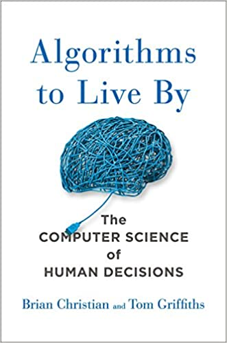
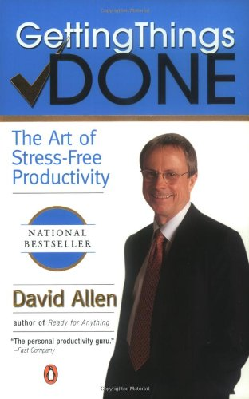

时间管理实际是自我如何利用时间的管理。目的是高效率使用自己的时间达到目的，减少和避免浪费。


*   时间如金钱

大部分人花钱很小心，很节省，一分一厘都可以很计较。但是很多人不珍惜时间。几小时，几天甚至几年过去了都不在乎。时间其实远远比钱更珍贵，因为时间就是自己的生命，生命是无价之宝，值得好好珍惜。

为了让爱钱的自己珍惜时间，一个方法就是给自己的每一个小时一个估算的金钱价值（例如一千美元），然后用一切管理金钱的方式来对待自己的时间：做预算，监控开销，调整（去掉浪费）。 把自己的时间（实际是生命）当金钱一样去投资和使用。

时间管理的方法和桌面软件，手机程序多如牛毛。最简便易行的一种是用电子日历，上面可以规划每天，每周，每月… 的时间安排。可以事前规划（预算），事后检查反省。监控管理自己的时间。

时间管理要注意避免碎片化，每天，每月，每年都有很多事情要做。所以必须把时间分成一片片来做不同的事情。分片的大小不能太大，也不能太小。 太大的例子是我一辈子就是一个时间片，只能做一件事。 太小的例子是我十分钟就是一个时间片，在不同事情中切换。 合理的时间片一般是一到两小时左右。

时间管理要注意留心自己的精力，知道每天什么时候自己的精力最好。就把最重要，最难的事情（例如学习，写作）放在精力最好的时间段做。在比较犯困的时候，做不太动脑的简单的事情，例如处理邮件，打电话等等。

人和人的差别主要看八小时之外在做什么。有成就的人都是孤独的，独自一人在晚上，周末努力学习和工作。一天应酬，喝酒，开聚会的人很难达到超出常人的目标。所以一个简单的检测就是看你晚上八点以后在做什么。 能长期坚持下来的晚上专注做事的人很少。



今天推荐《指导生活的算法》（Algorithms to Live By: The Computer Science of Human Decisions ）这本书，作者是Brian Christian 和Tom Griffiths。一个数学家和一个计算机科学家合作写的书。老实说这本书是我读过的科普书中最难啃的一本，愧对自己的本行专业。客观理由是这本书全是文字，没有多少图。有的时候解释算法的时候经常几句话，没有给出具体例子。优点是给出不少算法如何从最初的版本到最近的发展的历史进程。

全书11章：
* 优化停止，什么时候不再继续搜索
* 探索/利用，最新的和最好的东西的关系
* 排序算法
* 缓存
* 调度（时间管理）
* 贝叶斯理论和预测未来
* 过度拟合, 什么时候应该少思考
* 迭代法
* 随机数：什么时候应该碰运气
* 网络：我们如何互联的
* 博弈论：探讨别人的心理

人最珍贵的是时间，我们就跳入这本书第五章: 时间管理（或者任务调度 scheduling）的算法，看看有什么干货。


### 时间管理的书

我以前也读过一些时间管理的书。例如《Getting Thing Done /搞定：无压工作的艺术》给我的印象很深刻。直到今天我还保留了任何项目都维护个Inbox的任务列表，然后两分钟可以解决的任务就马上处理。《把时间当朋友》我也读过, 国产的通俗易懂的个人管理的比较全面的书籍，有些细节值得推敲，但是总体大方向是对的。 


《指导生活的算法》还提到了其他几本书:《Eat That Frog!/吃那只青蛙》提倡最先完成最难的任务，然后越干越轻松。《Now Habit/现在习惯》提倡优先安排社交和娱乐，然后中间穿插工作。这个想法比较有趣。这些大众化时间管理书籍的最大问题是不太具有科学性。 《指导生活的算法》的作者认为应该从计算机和数学角度，看最优的算法，用于人的时间管理。 任务调度这章主要讲了两种算法：最早截至日期优先调度法（Earliest Due Date），最短处理时间优先调度法(Shortest Processing Time).

### 最早截止日期调度法


这个算法很简单：假设你有一堆任务，每个任务有不同的截至时间。那么最优的调度法就是优先做截至日期最早的那个任务。这样做，可以保证所有任务的等待完成时间的总和是最小。这个算法很符合人的直觉，大部分人已经在用。


如果允许做任务的时候中断当前任务，处理新出现的任务，也是类似方法。看看新出现的任务的截至时间是否比当前任务的更早。如果是，就切换到新任务，否则继续做当前任务。


如果多个任务之间有先后的制约，比如一个任务必须在另一个任务之前完成。情况就复杂了一点，不过还是有最优算法：Lawler's algorithm 劳勒算法。 劳勒算法从后往前倒着生成调度的顺序的队列。每次只看当前还没有调度的任务中，哪些没有（还没有调度的）后续任务，在这些任务中找出最后截至的一个，放入调度队列的最前面。这个过程重复，直到所有任务都调度完了。


下面给出6个任务（j1,j2,.., j6）的调度例子，互相的先后依赖关系组成树状图，顶层的任务比下一层的必须先完成。 任务下面括号内的数字是截至日期。

```
      j1
     (2)
    /   \
   j2    j3
  (2)    (4)
  / \     |
 j4 j5   j6
(3) (5)  (6)
```

劳勒算法的步骤：
* 目前没有后续任务的任务是 j4, j5, j6。最晚截至日期的是j6(6). 所以把它放入调度队列的最前面 S=[j6]
* 剩下的任务中，没有还没有调度的后续任务的任务是 j3, j4, j5。最晚截至日期的是j5（5）. 把它放入调度队列的最前面 S=[j5,j6]
* 继续算法，j3, j4 没有还没有调度的后续任务。j3截至日期是最后。把它放入调度队列的最前面S=[j3,j5,j6]。
* 继续算法，可以调度剩下的任务， 调度队列最后变成S=[j1, j2, j4,j3, j5, j6]

### 摩尔算法（Moore's algorithm）

最早截止日期调度法有个最大问题，就是假设所有任务必须都完成，即使前面有拖延了，后面的任务还是一个个的拖延着也必须做完。这个在实际中不现实，实际生活是可以丢弃任务的， 避免所有任务都拖延。 


书中提到的有趣的例子是吃买的各种水果，不同水果有不同的腐烂时间。按最早腐烂时间调度吃水果，如果发现有过期的水果了，以后的所有水果会都吃过期的。没人愿意这么干。


摩尔算法（Moore's algorithm）是最早截止日期调度法的变种。允许丢弃过期的任务，目标是最小化丢弃任务的数量（最大化完成的任务数）。摩尔算法还是用最早截止日期算法，也就是按照过期时间吃，哪个最先过期水果就先吃那个。吃了几天一旦发现这么吃下去肯定吃不完，就应该扔掉剩下的水果中吃起来最花费时间那个水果。然后继续按照最近截止日期吃，一旦发现又快吃不完了，再扔掉剩下的水果里最大的那个。


### 最短处理时间优先调度法

这个算法是假设每个任务对应一个客户，允许拖延（没有绝对的截至日期），但是所有客户的等待时间的总和应该最小。算法非常简单，就是优先完成占用时间最短的那个任务。


看一个例子，两个任务的调度 j1(4 ), j2 (1)。括号里是每个任务占用的时间（天数）。有两种调度法：
方法一：j1 (4), j2 (1).  j1 客户的等待时间 4天， j2客户的等待时间 4+1 = 5天。两个客户中的等待时间 9 天。

方法二：j2 (1), j1 (4) 。j2客户等待1天。j1等待1+4=5天。两个客户中的等待时间 6天。


所以最短处理时间的调度法（方法二）可以让所有客户总的等待时间最少。


如果允许做任务的时候中断当前任务，处理新出现的任务，也是类似方法。看看新出现的任务的处理时间是否比当前任务的更少。如果是，就切换到新任务，否则继续做当前任务。


### 任务密度优先调度法

最短处理时间优先调度法的前提是所有任务/客户的重要性是一样的。实际生活中经常有不同优先级/重要性的任务。所以需要修改。优化的算法是： 
估算一下每个任务的“重要程度”，算每个任务的“密度”。

         一个任务的密度 = 重要程度 / 完成时间

然后按照任务的密度从高到底的顺序去做事。 


一个经典的例子是对应按小时收费的律师，有一堆不同的任务，收费不同，收费高的更重要，除以时间，就是每小时的费率。律师应该做每小时收费最高的任务。生物界中的例子是动物吃食物的顺序，大多数是看热量，单位体积热量最高的食物(肉，坚果)，动物会优先吃。 所以大家爱先吃肉（热量密度高），不爱吃菜（热量密度低）。


这个算法是目前所有算法中通用性最好的算法。推荐第一个使用。满足要事优先的原则。

### 时间分片调度增加多任务响应度。

上面算法都是假设人可以一直做一个任务到完成。不用切换到其他任务，也不用休息。实际做不到。调度任务的一个重要指标是对客户的响应度，不能几个月做一个事情，满足一个客户。把其他客户丢一般不管。实际是每个任务每次做一些，对每个客户都有进度汇报。 


计算机增加响应度的做法而是把时间分成一片片，分配给不同的任务做。 人也应该把自己的时间分成片，例如一小时，一个半小时，甚至两小时一片。然后在这个时间片中处理任务。 分片的粒度不能太大 （8小时不休息不行）或者太小（5分钟太短，切换任务有不小开销）。 因为时间分片，多任务切换处理，场景的保存（每个任务的进度，文档归类）和切换（文档重新放到桌面或者计算机上打开）都有不小的开销。


### 没有最优算法的各种情况

如果任务没有截至时间，但是有先后完成的制约关系。目前没有最好算法。如果任务有优先级，又有截至日期。目前也没有最好算法。

科学家们实际上研究过各种调度的问题，发现7%的问题还根本不知道有没有最优算法。93%的已经有结论的调度问题中，只有9%是有优化算法的。其他84%的调度问题都已经证明是没有最优算法（不能在有限时间内找到最优解）。 所以说，调度问题有最优解的是少数。

这个现状给我们的启发就是：我们经常面对各种事情不知道该咋办，不是我们的错。科学家用最强大的计算机调度，也没有最优解！最好的通用算法还是 任务密度优先调度法 。而且研究发现，即使提前知道一个任务什么时候开始，需要花多少时间，也无法帮助进一步优化大多数情况。所以生活中的时间管理不要奢望做一件事提前预知具体任务要做什么，要花多少时间，而是遇到必须做的任务，潜下心去做就是了。

### 结论

到此为止，本书关于任务调度的算法就总结完了。结论就是尽量用任务密度优先调度法。老实说我有点失望，纯粹的计算机调度算法没有考虑人的因素，不是很全面。比如我自己用的时间管理法中有：
  1）精力管理。人的时间片和计算机的时间片不一样。人一天的精力是波动变化的。机器是运算力是恒定的。所以机器的调度算法不关心一天什么是否精力好。人就必须考虑，知道自己什么时候适合做什么事情。
  2）场景管理。除了人自身精力外，人对环境也很敏感。家里，办公室，教室，图书馆对人的影响很大。需要在合适的场景做合适的事情。
  3）优先级管理。 生命有限，每个人想做的事情都很多。要想有所突破，努力的同时也必须专注。一个流行的理论是你的工作20%的时间产生了价值的80% （一个单位也是80%的利润是20%的顶尖员工创造的）。基本是一个人80%的工作时间创造的价值极少。应该想办法把主要精力放在产生80%价值的事情上。


一个具体办法是采用沃伦·巴菲特 （美国著名长期投资家，2019/7排名世界第三首富）的5/25法则 （有人也翻译成 25/5 法则）。计算一下: 5/25正好是20%。巴菲特的法则实际是个任务按优先级进行调度的简便有效的算法，实现把你的全部精力集中在最重要的20%有价值的事情上。该法则适用于学习，职业，生活的各个领域。拿职业目标为例：
* 列出未来5年，或者更长时间段里要达到的25 个目标或者完成的事情。把它们放入一个清单。
* 精心挑选对你最重要的5条。
* 聚焦你所有的时间，精力花在这最重要的5条上。坚决不花一点精力在另外20条上。
* 如果完成了5个目标中的某一条，可以从20条中选一个新的重要目标。如果有了新的目标，除非万不得已，不替换前五条中的任何一条，而是挤掉后面20条中的一条。